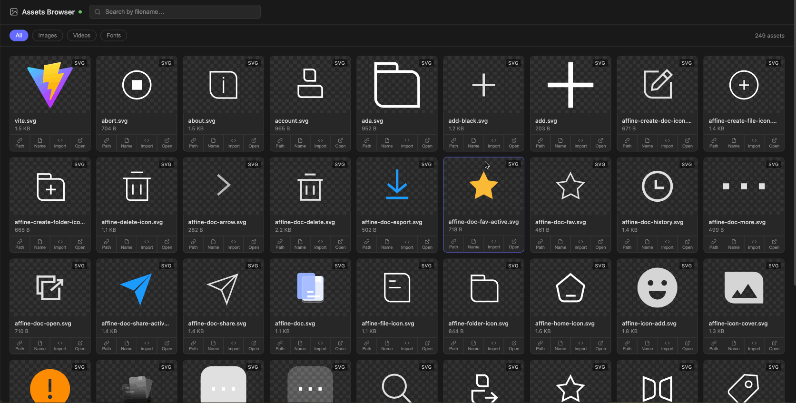

# vite-assets-browser

[](https://www.npmjs.com/package/vite-assets-browser)
[](./LICENSE)
[中文版](./README.zh.md)

A Vite plugin that launches a local asset browser during development. Browse all your project's images, videos, and fonts in a dark-themed grid UI — with a checkerboard background so SVGs are always visible.



## Why

When a project has many SVG assets, macOS Finder shows them on a white background — making SVGs that use `currentColor` or light fills completely invisible. This plugin gives you a dedicated browser with a checkerboard background, search, type filters, and one-click copy for paths and import statements.

## Install

```bash
npm install -D vite-assets-browser
```

```bash
pnpm add -D vite-assets-browser
```

```bash
yarn add -D vite-assets-browser
```

## Usage

```ts
// vite.config.ts
import { defineConfig } from 'vite'
import viteAssetsBrowser from 'vite-assets-browser'

export default defineConfig({
  plugins: [
    viteAssetsBrowser({ open: true }),
  ],
})
```

Then run `vite dev` — the asset browser opens automatically at **http://localhost:3044**.

## Options

| Option | Type | Default | Description |
|--------|------|---------|-------------|
| `port` | `number` | `3044` | Port for the asset browser server |
| `open` | `boolean` | `false` | Auto-open the browser when the dev server starts |
| `ignore` | `string[]` | `[]` | Extra glob patterns to exclude from scanning. `node_modules`, `.git`, `dist`, `build`, `.cache` are always excluded. |
| `extensions` | `RegExp` | see below | Regex to match asset file extensions. Default: `/\.(png\|jpe?g\|gif\|webp\|svg\|ico\|mp4\|webm\|ogg\|mov\|woff2?\|ttf\|otf\|eot)$/i` |

```ts
viteAssetsBrowser({
  port: 3044,
  open: true,
  // ignore additional directories
  ignore: ['**/tmp/**', '**/__generated__/**'],
  // only scan images
  extensions: /\.(png|jpe?g|gif|webp|svg)$/i,
})
```

## CLI

No install needed — use `npx` or `pnpm dlx` to run it directly in any directory:

```bash
# Scan current directory
npx vite-assets-browser
pnpm dlx vite-assets-browser

# Scan a specific directory
npx vite-assets-browser ./src

# Custom port and auto-open
npx vite-assets-browser --port 8080 --open

# Ignore extra directories
npx vite-assets-browser --ignore "**/tmp/**" --ignore "**/__mocks__/**"

# Only show PNG and SVG files
npx vite-assets-browser --ext "\.(png|svg)$"

# Combine options
npx vite-assets-browser ./assets --port 4000 --open --ext "\.(svg|png|webp)$"
```

If the package is already installed as a dev dependency, you can also add a script to `package.json`:

```json
{
  "scripts": {
    "assets-browser": "vite-assets-browser ./src --open"
  }
}
```

Then run with `npm run assets-browser` / `pnpm assets-browser`.

### Options

| Option | Description |
|--------|-------------|
| `[dir]` | Directory to scan (default: current working directory) |
| `-p, --port <port>` | Port to listen on (default: 3044) |
| `--open` | Open browser automatically |
| `--ignore <pattern>` | Glob pattern to ignore (can be repeated) |
| `--ext <regex>` | Regex for file extensions, e.g. `"\.(png\|svg)$"` |
| `-h, --help` | Show help |

## Features

- **Images** — PNG, JPG, JPEG, GIF, WebP, SVG, ICO
- **Videos** — MP4, WebM, OGG, MOV
- **Fonts** — WOFF, WOFF2, TTF, OTF, EOT
- Checkerboard background for transparent images and SVGs
- Search by filename
- Filter by asset type
- Infinite scroll grid
- Copy relative path, filename, or import statement with one click
- Open asset in a new tab
- Auto-refreshes when files change

## How It Works

1. The plugin hooks into Vite's `buildStart` lifecycle (dev only — no effect on production builds)
2. A lightweight Node.js HTTP server starts on the configured port
3. The server scans your project root with [fast-glob](https://github.com/mrmlnc/fast-glob), excluding `node_modules`, `dist`, `.git`, and `build`
4. A self-contained HTML page is served at the root — no external dependencies, no separate build step
5. File changes are detected via `fs.watch` and the asset list refreshes automatically

## Local Development

To test in another project before publishing:

```bash
pnpm add -D /path/to/vite-assets-browser
```

## License

MIT
